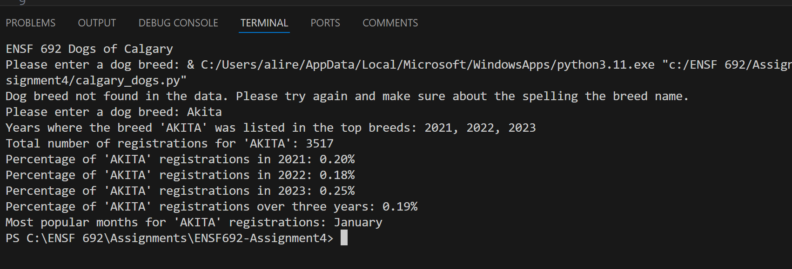

# ENSF692-Assignment4

calgary_dogs.py
@author: Alireza Ghasemi

# A terminal-based application for computing and printing statistics based on given input.
I acknowledge use of chatgpt to write, debug, learn, and understand the code and assignment.
It was satisfying to learn how these various tools work together to write a successful program.
I am not yet close to being good at python, but I will be better as time goes on, I believe.

# Below is the screenshot from the successful run of the program:

